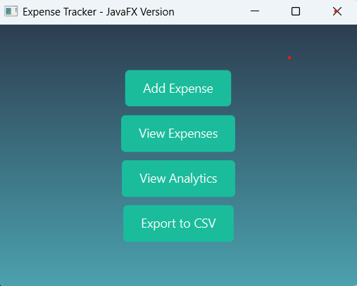
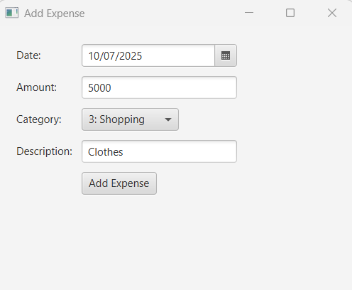
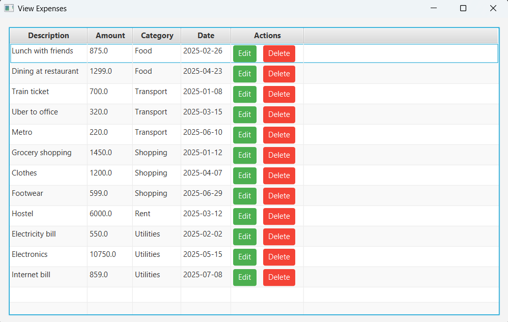
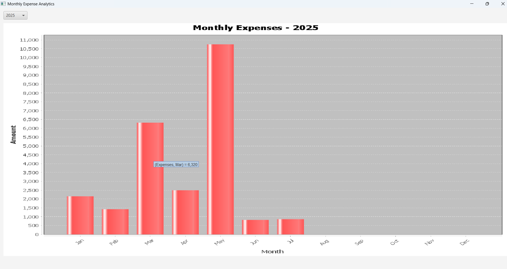

# Expense Tracker with Monthly Analytics

This is a Java-based desktop application built with **JavaFX**, **MySQL**, and **JFreeChart** that allows users to track daily expenses and view monthly analytics via bar charts. Users can categorize expenses, edit or delete them, and export data to CSV.

---

## Features

- Add and view expenses with date, amount, category, and description.
- Edit or delete existing expenses.
- View monthly analytics in a bar chart showing total expenses per month.
- Export expense data to a CSV file.
- Store data securely in a MySQL database using JDBC.

---

## Tools & Technologies Used

- **Java** – Core logic and backend
- **JavaFX** – User Interface (GUI)
- **MySQL** – Database storage
- **JDBC** – Database connectivity
- **JFreeChart** – Data visualization (bar charts)
- **Eclipse IDE**

---

## Screenshots

### Home Screen


### Add Expense Form


### View Expenses Table


### Monthly Analytics (Bar Chart)


---

## Database Schema

- **Table: categories**
  - `id` (INT, Primary Key)
  - `name` (VARCHAR)

- **Table: expenses**
  - `id` (INT, Primary Key)
  - `description` (VARCHAR)
  - `amount` (DOUBLE)
  - `category_id` (INT, Foreign Key to categories)
  - `expense_date` (DATE)

---

## Export Data

Click the **"Export to CSV"** button to generate a `.csv` file with all current expenses in the application directory.

---

## How to Run

1. Clone this repository.
2. Set up the MySQL database and update DB credentials in `DBConnection.java`.
3. Open the project in Eclipse.
4. Run the `Main.java` class.
5. Use the GUI to manage expenses.

---

##  Project Structure

```
ExpenseTracker/
├── src/
│   └── com/expensetracker/
│       ├── ExpenseTrackerMain.java        # Launches the application
│       ├── AddExpenseView.java            # View to add new expenses
│       ├── EditExpenseView.java           # View to edit existing expenses
│       ├── ExpenseTableView.java          # Displays all expenses in a table
│       ├── AnalyticsView.java             # Displays monthly analytics chart
│       ├── DBConnection.java              # Handles MySQL database connection
│       ├── Expense.java                   # Expense model class
│       ├── ExpenseDAO.java                # Data Access Object for expenses
│       ├── Category.java                  # Category model class
│       └── CSVExporter.java               # Exports data to CSV file
├── screenshots/                           # UI screenshots used in README
│   ├── home_screen.png
│   ├── add_expense.png
│   ├── view_expenses.png
│   └── analytics_chart.png
├── expenses_export.csv                    # Output CSV generated by app

```

---

## Author
Chinta Lakshmi Kanth

---

##  License

This project is built for educational purposes and is free to use.
